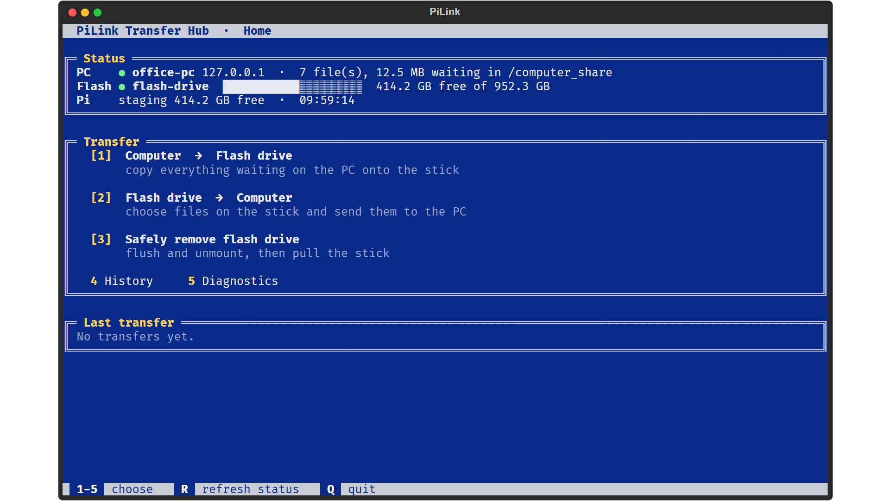
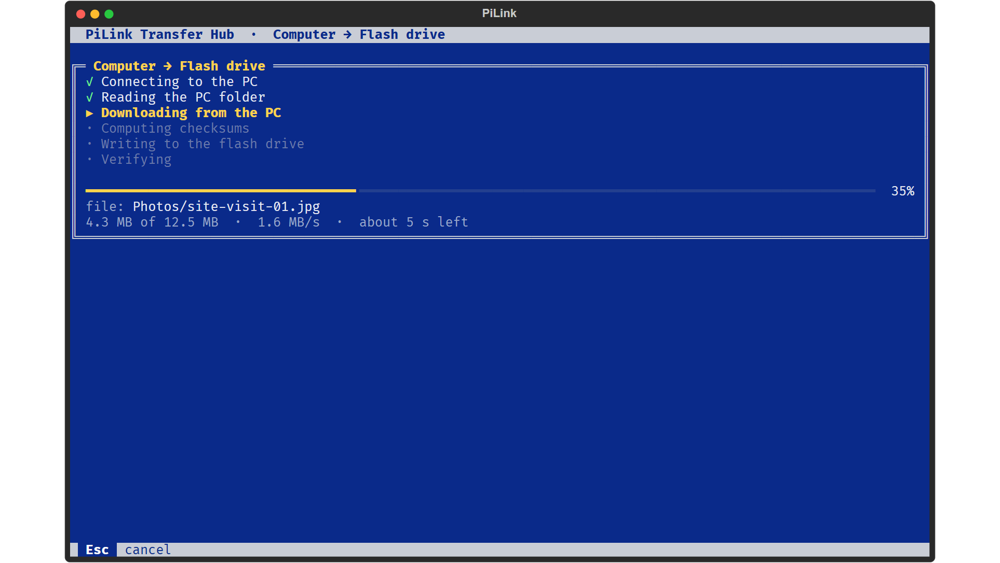
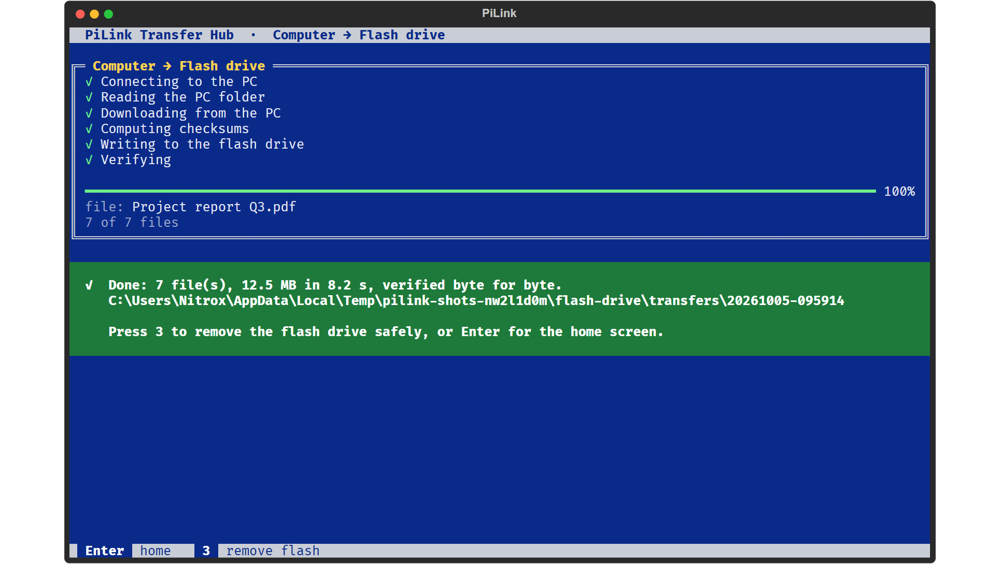
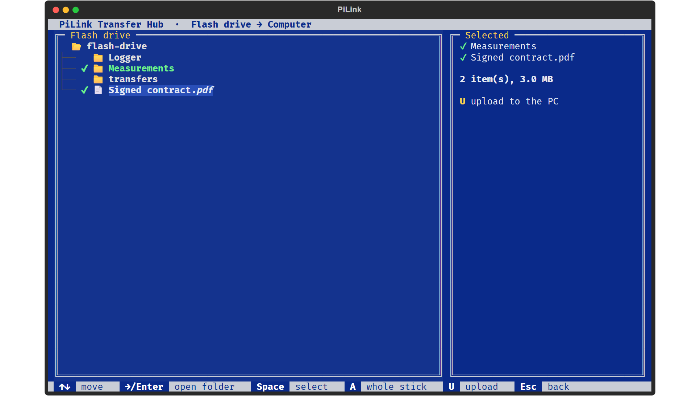
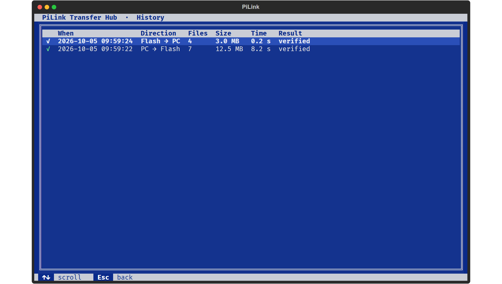
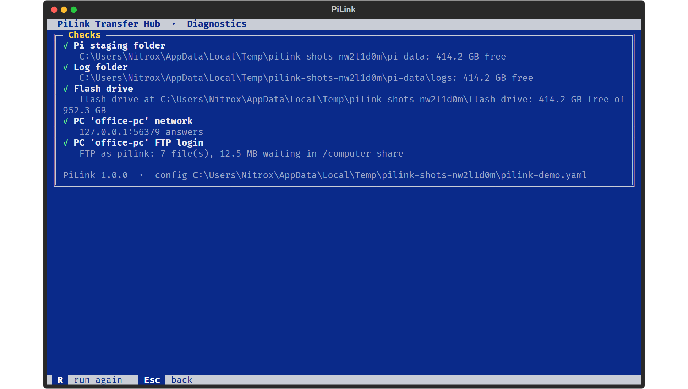

<div align="center">

# PiLink

**Turn a Raspberry Pi into a transfer box between a Windows PC and a USB flash drive, where every copy is verified before it says "done".**

[](https://github.com/Alifizz01/PiLink/actions/workflows/ci.yml)




</div>

```
 Windows PC                          Raspberry Pi                    USB flash drive
 FileZilla Server  ── Ethernet ──    PiLink on screen + keyboard ── USB ──  the stick
```

## What problem it solves

Some PCs must never have a USB stick plugged into them: lab and test-bench machines, shop-floor
PCs, anything under an IT policy that blocks removable media. Files still have to move between
those PCs and sticks. PiLink puts a Raspberry Pi in the middle. The PC only talks FTP over one
cable; the stick only ever touches the Pi.

| The usual way | What goes wrong | PiLink |
|---|---|---|
| Plug the stick into the PC | Not allowed, or a malware/data-leak risk | The stick never touches the PC. The PC only serves files over FTP (or FTPS) on a direct cable |
| Copy, see the progress bar finish, pull the stick | Data still in the write cache is lost; a failing stick returns different bytes | Every file is `fsync`'d to the stick, **read back and checksummed** before PiLink says done. "Safely remove" flushes and unmounts |
| Someone has to know Linux | Errors are tracebacks | Numbered keys on a blue screen, a file picker, and **every error is a sentence that says what to check** |
| "Did that work last Tuesday?" | Nobody knows | A history of every transfer, failed ones included, and a `checksums.txt` next to every copy |

## Screens

| | |
|---|---|
|  |  |
| **A transfer** shows each step, the bytes, speed and time left. Esc cancels. | **Done** only appears after every file was read back and compared. |
|  |  |
| **Flash → Computer** lets you pick files and folders (Space), never system folders. | **History** of every transfer, including the ones that failed and why. |



**Diagnostics** (key 5, or `pilink doctor` over SSH) checks the folders, the stick, the cable and the FTP login, and says what to do about anything that fails.

## Try it without a Pi

```bash
pip install "pilink[demo] @ git+https://github.com/Alifizz01/PiLink"
pilink demo
```

The demo starts a local FTP server playing the PC, a folder playing the stick, and sample files on both,
then opens the real UI. Everything stays inside one temp folder. It is also what produced every screenshot
above ([`tools/screenshots.py`](tools/screenshots.py)).

## Install on a Raspberry Pi

```bash
sudo git clone https://github.com/Alifizz01/PiLink /opt/pilink
sudo /opt/pilink/scripts/setup_pi.sh --static-ip 192.168.50.2/24     # Lite or Desktop is detected
sudo nano /etc/pilink.yaml                                           # the FileZilla user and folders
pilink doctor
```

Two ways to run it, chosen with `--mode` (or detected automatically):

| | **Raspberry Pi OS Lite** | **Raspberry Pi OS with desktop** |
|---|---|---|
| PiLink appears | full screen on the console from boot, like an appliance | in a window at login, and in *Menu → Accessories* |
| The stick is mounted by | PiLink's udev rule, at `/mnt/flash` | the desktop, as usual; PiLink finds it (`flash_mount: "auto"`) |
| Safely remove uses | a sudoers entry allowing only that unmount | `udisksctl`, the same as the desktop's eject button |

The full walkthrough, including the FileZilla Server settings on the PC (users, folders, TLS,
firewall), is in **[docs/SETUP.md](docs/SETUP.md)**. When something does not connect:
**[docs/TROUBLESHOOTING.md](docs/TROUBLESHOOTING.md)**.

## Using it

| key | |
|---|---|
| **1** | **Computer → Flash drive.** Everything in the PC's share is downloaded, written to `transfers/<date-time>/` on the stick, read back and verified, with `checksums.txt` |
| **2** | **Flash drive → Computer.** Pick files/folders; they arrive in `uploads/<date-time>/` on the PC (never overwriting an earlier upload), every size checked on the PC |
| **3** | **Safely remove** the stick |
| **4** / **5** | History / Diagnostics |

Everything is also a command, for SSH or scripts: `pilink status`, `pilink pc-to-flash`,
`pilink flash-to-pc Measurements report.pdf`, `pilink eject`, `pilink history`, `pilink doctor`.

## How it is built and tested

- **Python + [Textual](https://textual.textualize.io)** for the console UI; standard-library `ftplib` for
  FTP and explicit FTPS (FileZilla Server 1.x requires TLS by default).
- **Checked at every step:** the stick must really be mounted (otherwise files would land on the SD card),
  free space is checked against the real total, sizes are checked against the server's listing, hashes
  are compared after reading the stick back, uploads are confirmed with `SIZE`.
- **18 tests** run both workflows end to end against a **real FTP server** (pyftpdlib) and cover the
  failure cases: wrong password, unreachable PC, a dropped connection, no stick, full stick, a byte corrupted on the stick,
  cancel, bad config, desktop automount. One test drives the **real UI headless with key presses**.
  CI runs them on Python 3.9, 3.11 (Bookworm's) and 3.12.

How the pieces fit: [docs/architecture.md](docs/architecture.md).

## Upgrading from the 2025 version

Rerun `setup_pi.sh`. Your `/etc/pilink.yaml` keeps working (retired sections are ignored), the
old `pilink-usb-watcher` service is removed (it copied every transfer a second time), and the
service now runs as your real user instead of the `pi` account that current Raspberry Pi OS no
longer has. If FileZilla Server is 1.x, add `tls: true` to the endpoint.

## License

MIT · © Muhamad Alif Izzuwan Bin Ibrahim
