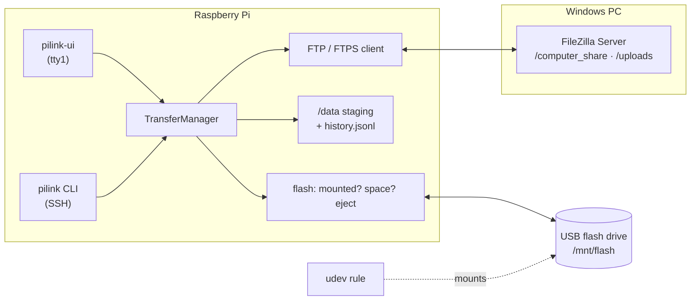

# How PiLink works

## The two workflows

**Computer → Flash drive**

1. Refuse to start unless something is really mounted at `/mnt/flash` and writable.
   (Writing to an empty mount point would put the files on the SD card.)
2. Connect (FTP or explicit FTPS) and list `download_root` recursively, with sizes.
3. Check free space on the Pi and on the stick against the real total.
4. Download into `/data/pc_inbox/<date-time>/`, byte-accurate progress.
5. Every file's size must match what the server listed.
6. SHA-256 every file, copy to `/mnt/flash/transfers/<date-time>/` with an `fsync` per file.
7. Read every file back from the stick and compare its hash. Only then: success.
8. `checksums.txt` next to the files (`sha256sum -c` compatible).

**Flash drive → Computer**

1. The selection must be inside the stick; system folders (`System Volume Information`, …) are skipped.
2. Copy to `/data/flash_outbox/<date-time>/` so the stick can be removed while uploading, and hash.
3. Upload into `upload_root/<date-time>/` (never overwriting an earlier upload) plus `checksums.txt`.
4. Ask the PC for every file's size (`SIZE`) and compare. A server that will not say is reported
   as "sent", not as "verified".

Both: every run, failed or not, goes into `/data/history.jsonl`; staging folders older than
`retention_days` are deleted after a successful run; Esc cancels between blocks.

## Code

| file | role |
|---|---|
| `src/pilink/config.py` | loads `/etc/pilink.yaml`; errors name the exact key; accepts the 2025 layout |
| `src/pilink/ftp_client.py` | FTP/FTPS, recursive listing (MLSD with a LIST fallback), progress, every error turned into a sentence |
| `src/pilink/transfer_manager.py` | the two workflows above |
| `src/pilink/storage.py` | hashing, fsync'd copies, space, cleanup |
| `src/pilink/flash.py` | is the stick there, its label and space, safe eject |
| `src/pilink/history.py` | the transfer log |
| `src/pilink/doctor.py` | the checks behind `pilink doctor` and the Diagnostics screen |
| `src/pilink/ui/` | the Textual console UI |
| `src/pilink/cli.py` | `pilink` command line |
| `src/pilink/demo.py` | `pilink demo`: a local FTP server and folders standing in for the PC and the stick |

## Tests

`pytest` runs both workflows end to end against a real FTP server (pyftpdlib) on localhost,
plus the failure cases: wrong password, unreachable PC, no stick mounted, not enough space, a
byte corrupted on the stick, cancel, bad config. `tests/test_ui.py` drives the real UI headless
with the keys a person would press.
